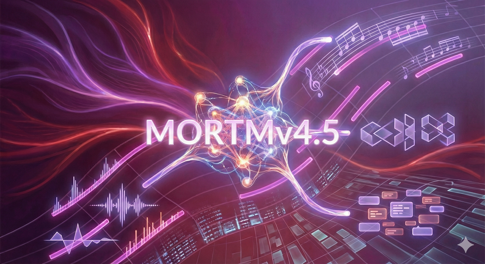

<div align="center">
  

  <h1>MORTM: Metric-Oriented Rhythmic Transformer for Music Generation</h1>

  <p>
    <b>Takaaki Nagoshi</b>
  </p>
  <p>
    <em>Project.MORTM Research Group</em>
  </p>

  <a href="https://github.com/Ayato964/mortm/blob/master/LICENSE">
    
  </a>
  
  
  
</div>

<div align="center">
  <br>
  <a href="./README_ja.md"></a>
  <a href="./README.md"></a>
</div>
---

## Abstract

Autoregressive models based on the Transformer architecture have achieved remarkable success in symbolic music generation. However, maintaining long-term structural coherence and rhythmic consistency remains a significant challenge, as standard tokenization methods often neglect the hierarchical nature of musical time. 

We present **MORTM (Metric-Oriented Rhythmic Transformer for Music)**, a novel framework that explicitly models metric structures through a bar-centric tokenization strategy. Version 4.5 introduces a scalable **Sparse Mixture of Experts (MoE)** architecture and **FlashAttention-2** integration, enabling efficient training on extended contexts. Furthermore, we propose a **Reinforcement Learning from Music Feedback (RLMF)** pipeline using Proximal Policy Optimization (PPO), where the generator is aligned with stylistic objectives defined by a BERT-based reward model (BERTM).

---

## 1. Key Contributions

* **Metric-Oriented Tokenization**: A specialized vocabulary and encoding scheme that encapsulates musical events within a metric grid, enforcing bar-level structural integrity.
* **Sparse Mixture of Experts (MoE)**: Implementation of Top-2 gating MoE layers to decouple model capacity from inference cost, allowing for massive parameter scaling.
* **Efficient Long-Context Modeling**: Integration of **FlashAttention-2** and relative positional embeddings (**ALiBi/RoPE**) to handle extended musical sequences with linear memory complexity.
* **Reinforcement Learning Alignment**: A complete PPO-based RLHF pipeline that fine-tunes the autoregressive policy using rewards derived from a bidirectional discriminator (BERTM).
* **Multimodal Scalability**: Extensions for audio spectrogram modeling (**V_MORTM**) and piano-roll vision processing (**MORTM Live**).

---

## 2. Architecture

MORTM is built upon a decoder-only Transformer backbone, optimized for the nuances of symbolic music data.

### 2.1 Sparse Mixture of Experts (MoE)
To enhance the model's representational power without incurring prohibitive computational costs, we replace standard Feed-Forward Networks (FFNs) with MoE layers in selected blocks.
- **Routing Mechanism**: A learnable gating network routes each token to the Top-$k$ experts (default $k=2$).
- **Expert Specialization**: This allows different experts to specialize in distinct musical textures (e.g., rhythmic accompaniment vs. melodic phrasing).

### 2.2 Attention Mechanism
We employ **FlashAttention-2** to accelerate the attention computation.
$$\text{Attention}(Q, K, V) = \text{softmax}\left(\frac{QK^T}{\sqrt{d_k}}\right)V$$
Combined with **Rotary Positional Embeddings (RoPE)**, the model effectively captures relative timing dependencies across thousands of tokens.

### 2.3 Reward Modeling (BERTM)
**BERTM (Bidirectional Encoder Representations for Music)** acts as a critic. Pre-trained on masked language modeling (MLM) and fine-tuned for genre/quality classification, it provides scalar rewards that guide the PPO training phase.

---

## 3. Installation & Prerequisites

This research code is implemented in PyTorch. For optimal performance, especially with FlashAttention-2, an NVIDIA GPU (Ampere architecture or newer) is recommended.

```bash
# Clone the repository
git clone [https://github.com/Ayato964/mortm.git](https://github.com/Ayato964/mortm.git)
cd mortm

# Install core dependencies
pip install torch torchvision torchaudio --index-url [https://download.pytorch.org/whl/cu118](https://download.pytorch.org/whl/cu118)
pip install flash-attn --no-build-isolation

# Install project requirements
pip install -r requirements.txt
